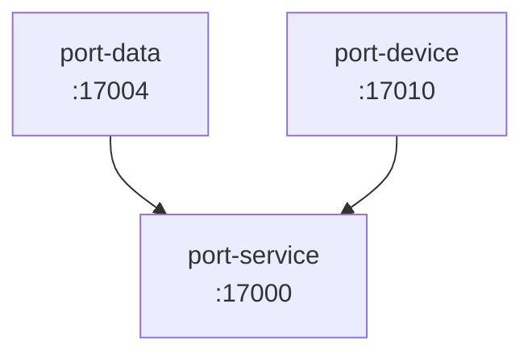

# 系统总览

> 由 `/document-systems` 自动生成
> 仓库：fabusurfer

## 子系统清单

| 子系统 | 类型 | 端口 | 路径 | 上游依赖 | 详细文档 |
|---|---|---|---|---|---|
| port-data | Java 服务 | 17004 | port-data | port-service | [查看](./port-data/architecture.md#1-概览) |
| port-device | Java 服务 | 17010 | port-device | port-service | [查看](./port-device/architecture.md#1-概述) |

## 依赖关系图

## 拓扑层级

层级用于决定文档生成顺序，下层依赖上层。

- **L0**：port-service（基础层）
- **L1**：port-data, port-device

## 跨系统通信方式

| 协议 | 使用场景 | 涉及子系统 |
|---|---|---|
| Kafka | 异步事件、状态广播 | port-device |

## 数据资产索引指引

各子系统的具体数据资产清单见各自文档的 §7 数据资产：

- `<子系统>/architecture.md#7-数据资产`

## 辅助资源

无

## 系统架构特点

（人工补充：模板里没有这一章，引擎解析容忍但 lint 记为存量漂移，不阻塞。）

## 6. port-data 报表数据链路补充

（非法漂移：根文档不应出现带编号的 §章节；引擎容忍解析、lint 报告、update_root 绝不碰。）

## 文档维护说明

本文档由 `/document-systems` skill 生成。
